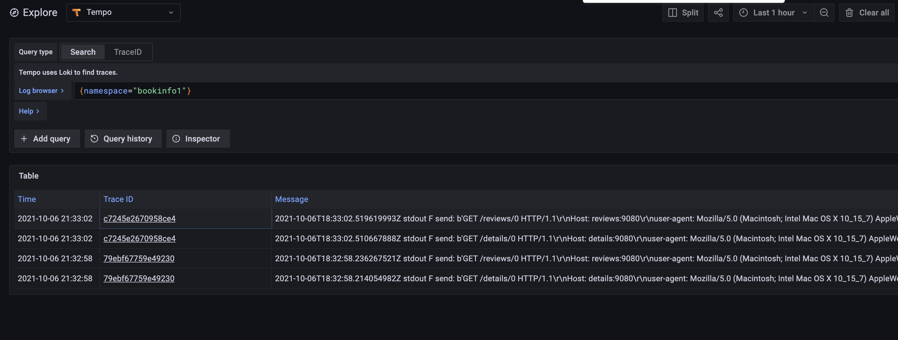

# Purpose
Cloud Native approach have solved many single units of complexities, but it have created tools sprawl within for teams. This demo show how to implement single pane of glass for observability tools based on Kuma envoy based service mesh (https://kuma.io/)

Components

| Component 	| Purpose 	|   
|-----------	|-----
| Kuma          | Envoy based service mesh |
| Loki          | Centralized logging service |
| Grafana       | Dashboards| 
| Tempo         | Traces storage solution |


 

 
# HOW TO INSTALL
## General Overview
## Infra Setup
All is being deployed on GKE for sake of simplicity
```
1. Install GKE Cluster
gcloud container clusters create sample-cluster \
    --release-channel stable \
    --zone europe-west4-a \
    --node-locations europe-west4-a
```
Don't forget to change Kubernetes context before moving further

## Tracing Setup
0. Add helm repos
```
helm repo add grafana https://grafana.github.io/helm-charts
```
1. Setup tracing namespace 
```
kubectl apply -f yamls/0-tracing.yaml
```
2. Install Grafana
```
helm install grafana grafana/grafana -n tracing --version 6.13.5  -f yamls/5-grafana.yaml
```
3. Install Tempo
```
helm install tempo grafana/tempo --version 0.7.4 -n tracing -f  yamls/1-tempo.yaml
```

5. Install Open Telemetry Collector
```
kubectl apply -f yamls/3-otel.yaml
```
## Kuma Install
0. Get binary
``` bash
curl -L https://kuma.io/installer.sh | sh -
```

1. Install Kuma
```
./kumactl install control-plane | kubectl apply -f -
```
2. Enable logging
```
kumactl install logging | kubectl apply -f -
```
3. Enable collectors
```
kubectl apply -f yamls/6-kuma-collector.yaml
```

## App Install
1. Install Kong
```
kubectl apply -f https://bit.ly/k4k8s 
kubectl annotate ns kong kuma.io/sidecar-injection=enabled
kubectl delete pod --all -n kong  
```
2. Install book info sample app
```
kubectl apply -f yamls/7-ns.yaml
kubectl apply -f yamls/8-bookinfo.yaml
```

#Access
To Kuma control plane
```
kubectl port-forward svc/kuma-control-plane -n kuma-system 5681:5681
```
To Grafana
```
kubectl port-forward svc/grafana -n tracing 8081:80
```
To Bookinfo
- Find ingress and access public IP

Searching in loki:
```
{namespace="bookinfo"} |="TraceId"
```

Screens:
Overview from loggin side

From Tempo side

